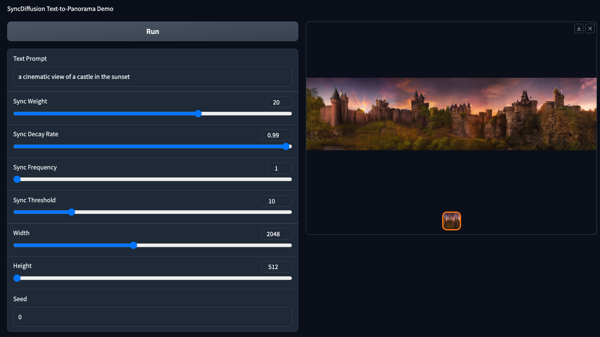
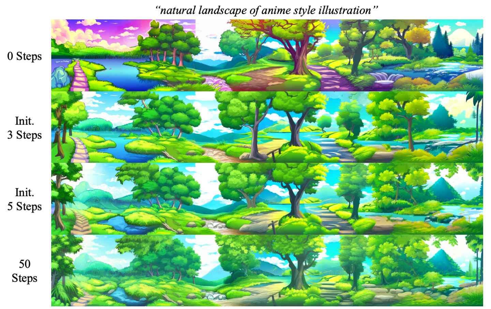

# SyncDiffusion: Coherent Montage via Synchronized Joint Diffusions


[**arXiv**](https://arxiv.org/abs/2306.05178) | [**Project Page**](https://syncdiffusion.github.io/) <br>

[Yuseung Lee](https://phillipinseoul.github.io/), [Kunho Kim](), [Hyunjin Kim](), [Minhyuk Sung](https://mhsung.github.io/) <br>

# Introduction
This repository contains the official implementation of **SyncDiffusion: Coherent Montage via Synchronized Joint Diffusions**.<br>
**SyncDiffusion** is a plug-and-play module that synchronizes multiple diffusions through gradient descent from a perceptual similarity loss. More results can be viewed on our [project page](https://syncdiffusion.github.io/).

[//]: # (### Abstract)
> The remarkable capabilities of pretrained image diffusion models have been utilized not only for generating fixed-size images but also for creating panoramas. However, naive stitching of multiple images often results in visible seams. Recent techniques have attempted to address this issue by performing joint diffusions in multiple windows and averaging latent features in overlapping regions. However, these approaches, which focus on seamless montage generation, often yield incoherent outputs by blending different scenes within a single image. To overcome this limitation, we propose SyncDiffusion, a plug-and-play module that synchronizes multiple diffusions through gradient descent from a perceptual similarity loss. Specifically, we compute the gradient of the perceptual loss using the predicted denoised images at each denoising step, providing meaningful guidance for achieving coherent montages. Our experimental results demonstrate that our method produces significantly more coherent outputs compared to previous methods (66.35% vs. 33.65% in our user study) while still maintaining fidelity (as assessed by GIQA) and compatibility with the input prompt (as measured by CLIP score).

# Get Started
Our code is tested with Python 3.9, CUDA 11.3 and Pytorch 1.12.1.

## Installation
First, clone our repository:
```
git clone https://github.com/KAIST-Geometric-AI-Group/SyncDiffusion.git
cd SyncDiffusion
```
Then you either can create a new conda environment:
```
conda env create -f environment.yml
conda activate syncdiffusion
```
or install essential packages into an existing environment:
```
pip install -r requirements.txt
```

## Generation
We provide a simple demo code for SyncDiffusion at `notebooks/syncdiffusion_demo.ipynb`.

You can also generate a panorama with SyncDiffusion by:
```
sh sample_syncdiffusion.sh
```

## Gradio Demo
We provide a Gradio Demo of SyncDiffusion with an easy control of the hyperparameters. First, install Gradio with 
```
pip install gradio
```
and run the demo with
```
python gradio_syncdiffusion.py
```



## Setting SyncDiffusion Hyperparameters
* We have observed that `w=20` is a suitable weight value for SyncDiffusion in terms of image coherence and quality. However, you can freely test different weights by changing the `sync_weight` parameter.
* For computation efficiency, you can set the `sync_thres = N` so that SyncDiffusion computes the gradient for only the **first N steps** of the sampling process. The below figure shows the results of `N = 0, 3, 5, 50`.



# Updates
[x] Release code for SyncDiffusion.
[ ] Release Huggingface Demo for panorama generation.

# Citation
If you find our work useful, please consider citing:
```
@article{lee2023syncdiffusion,
    title={SyncDiffusion: Coherent Montage via Synchronized Joint Diffusions}, 
    author={Yuseung Lee and Kunho Kim and Hyunjin Kim and Minhyuk Sung},
    journal={arXiv preprint arXiv:2306.05178},
    year={2023}
}
```

# Acknowledgement
Our code is heavily based on the [official implementation](https://github.com/omerbt/MultiDiffusion) of [MultiDiffusion](https://multidiffusion.github.io/). We borrowed the Github template from [SALAD](https://github.com/KAIST-Geometric-AI-Group/SALAD).
